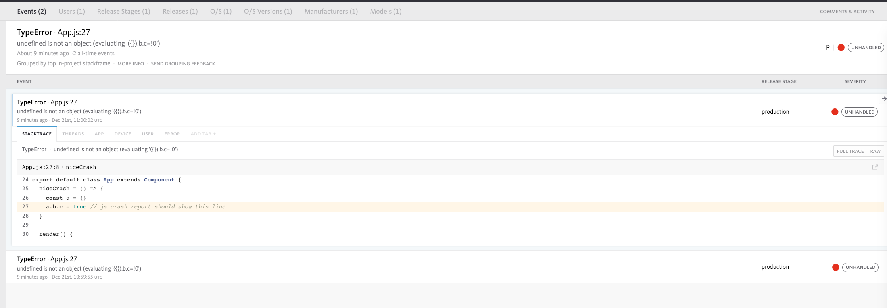
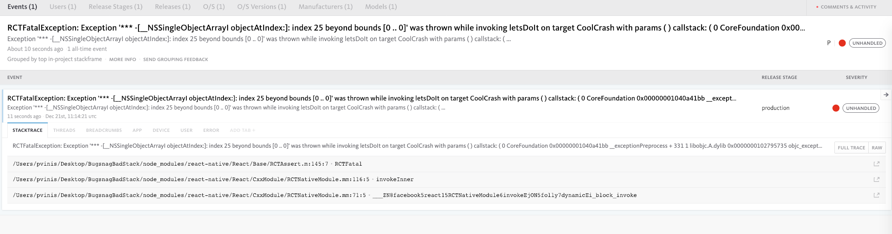

# UPDATE: This should be fixed on this [PR](https://github.com/facebook/react-native/pull/23691) and it will land on RN 0.60.0

Issue: https://github.com/bugsnag/bugsnag-react-native/issues/300

# steps I took to setup this repo:
- `react-native init BugsnagBadStack`
- `cd BugsnagBadStack`
- commit
- `yarn add bugsnag-react-native`
- `react-native link`
- commit
- create release xcode scheme
- commit
- add js crash
- commit
- add sourcemap upload script
- commit
- add native crash
- commit
- add dsym upload script
- commit
- readme updates

# reproduce:
- `yarn install`
- `open ios/BugsnagBadStack.xcodeproj`
- switch to `BugsnagBadStack Release` scheme
- `yarn start`
- press play on xcode
- `./scripts/upload-sourcemap`
- tweak the path in .scripts/upload-dsym
- `./scripts/upload-dsym`
- tap `CRASH JS` button
- see everything is nice

- tap `CRASH NATIVE` button
- see that the stacktrace looks weird, no formatting

